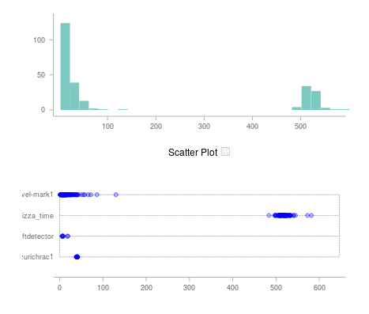

This project uses Flask, Requests and the [metricsgraphics.js](http://metricsgraphicsjs.org/)
library for time-series data, to collect and plot data from **The Things Network**.

# Starting

Install a virtualenv (e.g. with poetry), activate, and `pip install -r requirements.txt`

Run `python ttndash/__init__.py`.

Each chart is defined in the `project/buildui.py` file. The charts
are then assembled into a layout in `buildui.get_layouts`.

In "production", use:

`gunicorn -b 0.0.0.0:5050 ttndash`
